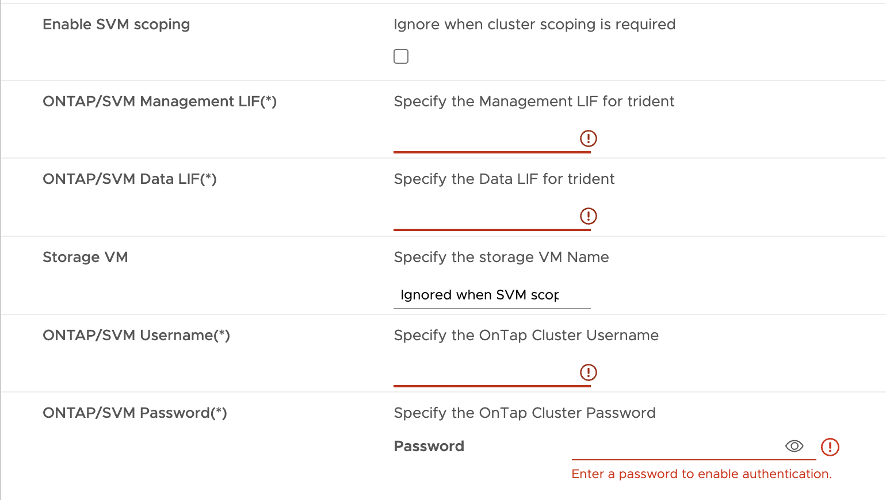

= HA 3ノード構成の導入方法
:allow-uri-read: 
:icons: font
:imagesdir: ../media/

[role="lead"]
HA 3ノードは、小規模、中規模、大規模のいずれかの構成で構成できます。

* 小規模なHA 3ノード：各ノードに8個のCPUと16GBのRAMを搭載。
* 中規模HA（3ノード）各ノードに12個のCPUと24GBのRAMが搭載されています。
* 大規模なHA 3ノードには、各ノードに16個のCPUと32GBのRAMが搭載されています。

* このタスクについて *

このタスクでは、小規模、中規模、または高可用性の構成にHA 3ノードを設置する手順を説明します。

NOTE: コンテンツライブラリの作成は、HA 3ノード構成を導入するための必須の手順です。を参照してください link:../deploy/concept_how_to_download_ontap_tools.html["ONTAP ツールのダウンロード方法"] を参照してください。

NOTE: 導入を進める前に、ONTAPツールのインストール中に、インベントリ上のクラスタのDistributed Resource Scheduler（DRS）を* conservative *に設定します。

* 手順 *

. vSphereサーバにログインします。
. コンテンツライブラリに移動し、コンテンツライブラリを選択します。
. ページ右側の*[Actions]*を選択し、*[Import item]*を選択してOVAファイルをインポートします。
. OVAを導入するリソースプールまたはホストに移動します。
. 目的のデータセンターを右クリックし、*[Deploy OVF template...]*を選択します。
. _.ova_fileが保存されているコンテンツライブラリを選択し、*[次へ]*を選択します。
. 仮想マシンの名前とフォルダを選択し、*[Next]*を選択します。
. ホストを選択して*[次へ]*を選択します。
. テンプレートの概要を確認し、* Next *を選択します。
. ライセンス契約を読んで同意し、* Next *を選択します。
. [構成ウィンドウ]*で、要件に応じて*[HA Three Node（小規模）]*、*[HA Three Node（中規模）]*、または*[HA Three Node（大規模）]*構成を選択します。
. 構成ファイルとディスクファイルのストレージを選択し、* Next *を選択します。
. 各ソースネットワークのデスティネーションネットワークを選択し、*[Next]*を選択します。
. [テンプレートのカスタマイズ]*>*[システム構成]*ウィンドウを選択します。次の詳細を入力します。
+
.. VASA Providerのユーザ名とパスワード：このユーザ名とパスワードは、VASA ProviderをvCenterに登録する際に使用されます。
.. [Enable ASUP]*チェックボックスはデフォルトで選択されています。
+
ASUPを有効または無効にできるのは導入時のみです。

.. 管理者のユーザー名と管理者のパスワード：* ONTAP tools Manager* UIへのログインに使用するパスワードです。
.. NTPサーバ情報を*[NTP Servers]*フィールドに入力します。
.. メンテナンスユーザのパスワード：「メンテナンスコンソールオプション」へのアクセスを許可するために使用します。

. [テンプレートのカスタマイズ]*>[VASA Provider証明書]*ウィンドウで、次の詳細を入力します。
+
.. Enable Custom CA certificateチェックボックスをオンにします。これは、マルチVCをイネーブルにするために必要です。マルチVC環境以外の場合は、このチェックボックスを無視します。証明書とドメイン名を指定する必要はなく、仮想IPの詳細だけを指定する必要があります。
.. ルート証明書と中間証明書をコピーして貼り付けます。
.. リーフ証明書と秘密鍵をコピーして貼り付けます。
.. 証明書の生成に使用したドメイン名を入力します。
.. ロードバランスIPの詳細を入力します。

. [Customize template]*>*Deployment Configuration *]ウィンドウで、次の詳細情報を入力します。
+
.. [Virtual IP for K8s Control Plane]に空いているIPアドレスを入力します。これはKubernetes APIサーバに必要です。
.. 直接接続型SVMを使用する場合は、*[SVMスコープを有効にする]*オプションのチェックボックスをオンにします。ONTAPクラスタを使用する場合は、このチェックボックスをオフにします。
+

NOTE: SVMスコープを有効にした場合は、管理IPでのSVMサポートをすでに有効にしておく必要があります。

.. 次の図に示す詳細を入力します。
+

.. [ONTAP / SVM管理LIF]*で、ONTAPクラスタまたはSVM管理IPを入力します。
.. ONTAPクラスタまたはSVM * ONTAP/SVMデータLIF *を入力します。
.. Storage VMの場合、ONTAPのデフォルトのStorage VMの詳細を指定するか、新しいStorage VMを作成するかを選択できます。[SVMスコープを有効にする]を選択した場合は、*[Storage VM]*フィールドに値を入力しないでください。このフィールドは無視されます。
.. [ONTAP / SVMユーザ名]を入力します。
.. ONTAP / SVMのパスワードを入力します。
.. Enable Migrationはデフォルトで無効になっています。この選択は変更しないでください。
.. プライマリVMはデフォルトで有効になっています。この選択は変更しないでください。

. *テンプレートのカスタマイズ*>*コンテンツライブラリの詳細*ウィンドウで、*コンテンツライブラリ名*と* OVFテンプレート名*を入力します。
. [テンプレートのカスタマイズ]*>[vCenter構成]*ウィンドウで、コンテンツライブラリがホストされているvCenterの詳細を入力します。
. [テンプレートのカスタマイズ]*>[ノード構成]*ウィンドウで、3つすべてのノードのOVAのネットワークプロパティを入力します。
+

NOTE: ここで提供された情報は、インストールプロセス中に適切なパターンについて検証されます。不一致がある場合は、Webコンソールにエラーメッセージが表示され、入力した誤った情報を修正するように求められます。

+
次の詳細を入力します。

+
.. ホスト名。
.. ホスト名にマッピングされたIPアドレス。
.. プレフィックス長（IPv6の場合のみ）
.. ネットマスク（IPv4の場合のみ）
.. ゲートウェイ
.. プライマリDNS
.. セカンダリDNS
.. 検索ドメイン

. [テンプレートのカスタマイズ（Customize template）]*>[ノード2の構成（Node 2 Configuration）]*および[ノード3の構成（Node 3 Configuration）]*ウィンドウで、次の詳細を入力します。
+
.. ホスト名
.. IP アドレス

. [選択内容の確認]ウィンドウで詳細を確認し、*[完了]*を選択します。
+
タスクが作成されると、vSphereタスクバーに進捗状況が表示されます。

. タスクが完了したら、VMの電源をオンにします。
+
インストールが開始されます。インストールの進行状況は、VMのWebコンソールで追跡できます。
インストールの一環として、ノードの設定が検証されます。OVFフォームの*カスタマイズテンプレート*の各セクションで提供される入力内容が検証されます。不一致がある場合は、修正措置を講じるように求めるダイアログが表示されます。

. ダイアログプロンプトで必要な変更を行うには、次の手順に従います。
+
.. Webコンソールをダブルクリックして、コンソールの操作を開始します。
.. キーボードの上矢印キーと下矢印キーを使用して、表示されているフィールド間を移動します。
.. キーボードの右矢印キーと左矢印キーを使用して、フィールドに指定された値の右端または左端に移動します。
.. Tabキーを使用してパネル内を移動し、* OK *または*キャンセル*の値を入力します。
.. ENTERを使用して、* OK *または* CANCEL *のいずれかを選択します。

. [OK]*または[キャンセル]*を選択すると、指定した値が再度検証されます。値を3回修正するためのプロビジョニングがあります。3回以内に修正しなかった場合は、製品のインストールが停止し、新しいVMでインストールを試すことをお勧めします。
. インストールが完了すると、WebコンソールにONTAP tools for VMware vSphereが正常な状態にあることを示すメッセージが表示されます。

